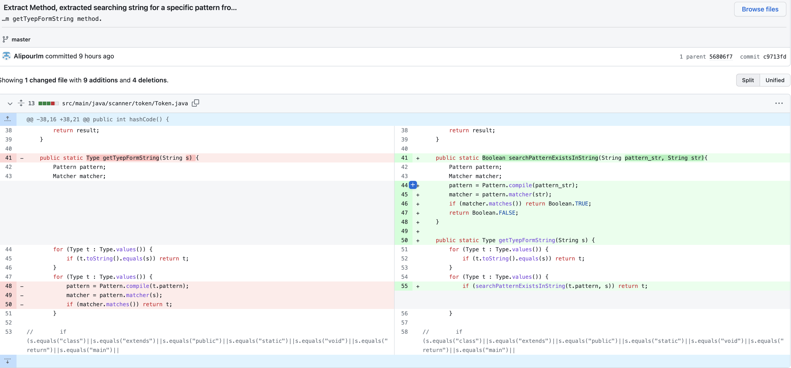

# software-engineering-lab-session7

  | `Person Number` | `First Name` | `Last Name` | `Student Number` |
  |:---------------:|:------------:|:-----------:|:----------------:|
  | `First Person` | Moahmmad Taha | Jahani-Nezhad | 98101363  |
  | `Second Person` | Iman | Alipour | 98102024 |

---

# مراحل انجام آزمایش

۱. دو مورد Facade:

۲. یک مورد State/Strategy یا استفاده از Polymorphism به جای شرط:

۳. یک مورد Separate Query From Modifier:

۴. سه مورد از سایر بازآرایی‌ها مانند Self Encapsulated Field یا …:

  - اولین بازآرایی‌ای که انجام می‌دهیم یک نمونه از Self Encapsulated Field در کلاس lexicalAnalyzer می‌باشد، کارهای انجام شده برای انجام این بازآرایی را می‌توانید در تصویر زیر مشاهده کنید:

برای انجام این بازآرایی برای فیلد matcher که در این کلاس private است متدهای getter و setter را نوشتیم و در داخل کلاس دسترسی به این فیلد را بروز کردیم.

  - دومین بازآرایی یک نمونه از Extract Method در کلاس  Token است، در تابع getTyepFormString که البته خودش یک اشتباه تایپی دارد (اما گفته شده بود این بازآرایی‌ها حساب نیستند!) در حلقه‌ی آخر اقدام به ایجاد یک matcher و سرچ در یک رشته می‌شود، در واقع این تابع یک کار واحد را انجام نمی‌دهد، برای همین ما بخش جست‌وجوی یک الگو در رشته را به صورت یک متد جدا در می‌آوریم تا اگر بعدا کد Token گسترش یافت و نیاز به جست‌وجوی یک الگو در یک رشته وجود داشت، نیازی به کپی کردن کد وجود نداشته باشد و از ایجاد این بوی بد در آینده جلوگیری می‌کنیم. تغییرات ایجاد شده در کد را می‌توانید در تصویر زیر مشاهده کنید.

  - سومین بازآرایی، یک Extract Method دیگر است اما منشا آن با قبلی متفاوت است، این بار ما یک متد بسیار پیچیده و بزرگ در ParseTable را برای افزایش خوانایی، وmaintainability کد به چند تابع کوچک‌تر می‌شکانیم. در واقع با این بازآرایی بوی بد Long Method را از بین می‌بریم. برای انجام این بازآرایی، از کد متد ParseTable، واحدهای منطقی calcTables و getGoToTable را استخراج کردیم تا خوانایی و maintainability کد این متد افزایش یابد و خطوط آن کمتر شود. تغییرات ایجاد شده را می‌توانید در شکل زیر مشاهده کنید.

  - چهارمین بازآرایی، مربوط به استفاده از Polymorphism به جای شرط می‌باشد. اگر در متن کدهای پروژه دقت کنیم، میبینم که سه بار روی `Type` از کلاس `Symbol` سوییچ کیس زده شده است. برای حل این مشکل، به جای اینکه در این کلاس یک فیلد Type داشته باشیم، دو نوع Symbol تعریف می‌کنیم. در هر کدام از این کلاس‌ها، یک تابع `getVarType` نیز تعریف می‌کنیم تا به جای استفاده از Switch-Case روی Type، تنها این تابع صدا زده شود. همچنین، کانستراکتور کلاس Symbol را Protected می‌کنیم و نوع کلاس را به Abstract تغییر می‌دهیم تا دیگر امکان New کردن از این کلاس وجود نداشته باشد و تنها کلاس‌های فرزند New شوند. در ضمن، یک تابع کمکی استاتیک داخل همین کلاس نیز تعریف می‌کنیم تا با دریافت یک Type و Address، نوع خاص Symbol مورد نیاز کاربر را تولید کرده و در خروجی بدهد. در نهایت، Switch-Case های اولیه را نیز حذف می‌کنیم. تغییرات مهم در تصاویر زیر قابل مشاهده هستند:

  - بازآرایی پنجم از نوع Separate Query From Modifier می‌باشد. در کل پروژه جستجو کردیم و تنها تابع Getter که دیتایی را تغییر می‌داد پیدا کردیم. این تابع در کلاس Memory قرار داشت که به جای Return کردن یک مقدار، ابتدا آن‌را تغییر داده و سپس مقدار قدیمی آن‌را برمی‌گرداند. این قسمت از کد نیاز به بازآرایی داشت. این دو تابع را به چهار تابع تبدیل کردیم: دو تابع برای برگرداندن مقدار و دو تابع دیگر برای تغییر مقدار. سپس تمامی استفاده‌های این توابع را یافتیم و در جاهای مورد نیاز، تابع‌های Update را پس از Getter ها برای تغییر اطلاعات صدا زدیم. تغییرات اساسی که در کلاس Memory اعمال شده، در تصویر زیر قابل مشاهده هستند:

  - 
# پرسش‌ها

۱. هر یک از مفاهیم زیر را در حد یک خط توضیح دهید.

- کد تمیز: کدی است که به راحتی خوانا است و با استفاده از قواعد و روش‌های مشخصی نوشته شده، خوانایی و قابلیت‌فهمی بالایی دارد و معمولا به راحتی قابل توسعه و تغییر است.

- بدهی فنی: بدهی فنی به معنی مجموع هزینه‌هایی است که به دلیل عدم رعایت معیارهای فنی مشخص در فرآیند توسعه نرم‌افزار، برای تعمیر و بهبود کد باید صرف می‌شود.

- بوی بد در کد: به مشکلاتی گفته می‌شود که در کد نوشته شده ولی باعث سختی خواندن، فهمیدن و توسعه آن می‌شود. این مشکلات معمولا مشکلاتی مانند نام‌گذاری نامناسب متغیرها و توابع، استفاده از منطق پیچیده و نامفهوم، عدم رعایت استانداردهای کدنویسی و... می‌شوند. بوی بد در کد می‌تواند باعث کاهش کیفیت نرم‌افزار، افزایش بدهی فنی و سختی نگهداری و توسعه آن شود.

۲. طبق دسته‌بندی وب‌سایت refactoring.guru، بوهای بد کد به پنج دسته تقسیم می‌شوند. در مورد هر کدام از این پنج دسته توضیح مختصری دهید.

وب‌سایت refactoring.guru پنج دسته اصلی بوی بد در کد را به صورت زیر دسته‌بندی کرده است:

- نفخ‌زده‌ها یا Bloaters: این بوی بد زمانی رخ می دهد که کد بیش از حد بزرگ، پیچیده و درک آن دشوار می شود. به عنوان مثال می توان به روش طولانی، کلاس بزرگ و Primitive Obsession اشاره کرد.

- سوء استفاده کنندگان شی گرا یا Object-Oriented Abusers: این بوی بد زمانی رخ می دهد که کد اصول شی گرا مانند اصل مسئولیت واحد (SRP)، اصل باز/بسته (OCP) و اصل جایگزینی لیسکوف (LSP) را نقض کند. نمونه هایی از این دسته عبارتند از کلاس خدا (God class)، کلاس داده (Data Class) و استفاده از سوییچ‌ها(Switch Statements).

- تغییر پیشگیری‌ کنندده‌ها یا Change Preventers: این بوی بد زمانی ایجاد می شود که کد به گونه ای طراحی شود که ایجاد تغییرات در آینده را دشوار کند. به عنوان مثال می توان به جراحی تفنگ ساچمه‌ای (تغییر در یک بخش از کد منجر به نیاز به تغییرات زیاد در سایر بخش‌های کد می‌شود)، سلسله مراتب موازی وراثت و تغییر واگرا اشاره کرد.

- بی‌مصرف‌ها یا Dispensables: این بوی بد زمانی رخ می دهد که کد حاوی قطعات غیر ضروری یا زائد باشد که می توان با خیال راحت بدون تأثیر بر عملکرد سیستم حذف شود. به عنوان مثال می توان به Dead Code، Lazy Class و Speculative Generality اشاره کرد.

- کوپلرها یا Couplers: این بوی بد زمانی اتفاق می‌افتد که کد حاوی coupling‌های زیادی باشد، به این معنی که تغییرات در یک قسمت از سیستم می‌تواند باعث ایجاد تغییراتی در قسمت‌های دیگر شود. به عنوان مثال می توان به Feature Envy، Message Chains و Middle Man اشاره کرد.

۳. یکی از انواع بوهای بد، Lazy Class است.

 - این بوی بد در کدام یک از دسته‌بندی‌های پنج‌گانه قرار می‌گیرد؟ 

بوی بد Lazy Class در دسته‌بندی پنج گانه بوی بد در کدنویسی، در دسته "Dispensables" قرار می‌گیرد. این بو به معنی وجود کلاس‌هایی است که فقط یک بخش کوچک از عملکرد سیستم را پوشش می‌دهند و به طور کلی از نظر کارایی بی‌اهمیت هستند.

 - برای برطرف‌کردن این بو، استفاده از کدام بازآرایی‌ها پیشنهاد می‌شود؟ 

برای برطرف کردن این بوی بد از کلاس‌های inline استفاده می‌شود، از آنجا که برای کاری که قرار است انجام شود نیاز به یک کلاس جدا نداریم می‌توانیم آن‌ها را به صورت inline تعریف کنیم.
روش دیگر استفاده از درهم کوبیدن سلسله مراتب یا Collapse Hierarchy است و در حالتی رخ می‌دهد که یک زیرکلاس کاملا شبیه به والد خود رفتار می‌کند، در این صورت این دو کلاس را با هم ترکیب می‌کنیم.

 - در چه مواقعی باید این بو را نادیده گرفت؟

گاهی اوقات یک Lazy Class به منظور ترسیم اهداف توسعه‌ی آینده ایجاد می‌شود، در این موارد، تلاش می‌کنیم تعادلی بین وضوح و سادگی در کد خودمان حفظ کنیم و این کلاس Lazy را از کد حذف نمی‌کنیم.

